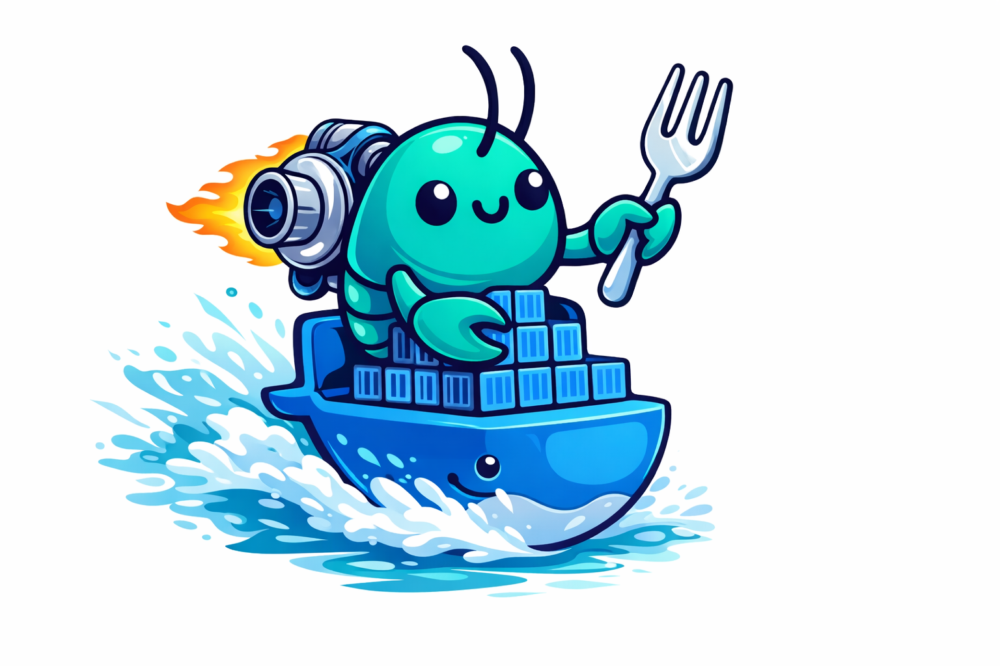

# TurboClaw




Dockerized AI agent runner with multi-provider support. Control it via TUI, REST API, or WhatsApp.

TurboClaw spawns ephemeral Docker containers to run AI coding agents (OpenCode, Claude Code, or Codex) against your tasks. It handles scheduling, retries, concurrency, cron jobs, tiered memory, and WhatsApp notifications — so you can queue up work and let agents grind through it.

## Quick Start

```bash
# Install dependencies
bun install

# First-time setup (checks Docker, picks AI provider, sets up core memory)
bun run src/index.ts setup

# Launch the TUI
bun run src/index.ts
```

## What It Does

- **Queue tasks** — create coding tasks via TUI, API, or WhatsApp message
- **Multi-agent** — run tasks with OpenCode, Claude Code (`claude -p`), or Codex (`codex exec`)
- **Docker isolation** — each task runs in its own container with a mounted workspace
- **Scheduling** — FIFO, priority, or round-robin strategies with configurable concurrency
- **Retries** — automatic retry on failure with configurable limits
- **Cron jobs** — recurring tasks on standard cron schedules (`*/30 * * * *`)
- **Alerts** — automatic alerts on task failure, lease expiry, WhatsApp disconnect
- **Tiered memory** — three-tier system (core/daily/weekly) with auto-pruning and TUI management
- **Pipelines** — multi-stage workflows with gates between stages
- **Self-improvement** — mount TurboClaw's own source into a container and let agents improve it
- **WhatsApp** — send a message from your phone, get notified when it's done

## Architecture

```
┌──────────────────────────────────────────────────────────────────────┐
│                         TurboClaw Host (Bun)                         │
│                                                                      │
│  ┌────────────┐   ┌──────────────┐   ┌──────────────┐               │
│  │   TUI      │   │   Gateway    │   │  WhatsApp    │               │
│  │  (Ink)     │   │  (REST API)  │   │  Bridge      │               │
│  │ 7 screens  │   │  port 7800   │   │  (Baileys)   │               │
│  └─────┬──────┘   └──────┬───────┘   └──────┬───────┘               │
│        │                  │                   │                       │
│        └──────────┬───────┴───────────────────┘                      │
│                   ▼                                                   │
│           ┌──────────────┐                                           │
│           │   Tracker    │  ← Source of truth (bun:sqlite)           │
│           │  tasks, runs │     tasks, runs, events, crons,           │
│           │  events, etc │     alerts, leases, pipelines             │
│           └──────┬───────┘                                           │
│                  │                                                    │
│           ┌──────▼───────┐     ┌──────────────┐                      │
│           │ Orchestrator │────▶│  Container   │                      │
│           │ (poll loop)  │     │  Manager     │                      │
│           │ scheduling,  │     │  docker run  │                      │
│           │ crons, retry │     │  per task    │                      │
│           └──────────────┘     └──────┬───────┘                      │
│                                       │                              │
│           ┌───────────────────────────┼──────────────────────┐       │
│           │  Memory Vault             │                      │       │
│           │  ~/.turboclaw/memory/     │                      │       │
│           │  ├── core/    (always)    │                      │       │
│           │  ├── tasks/   (daily)     │                      │       │
│           │  └── weekly/  (compiled)  │                      │       │
│           └───────────────────────────┼──────────────────────┘       │
├───────────────────────────────────────┼──────────────────────────────┤
│  Docker containers                    │                              │
│  ┌────────────────────────────────────▼────────────────────────────┐ │
│  │  turboclaw-worker:latest                                        │ │
│  │  OpenCode / Claude Code / Codex                                 │ │
│  │  + opencode-browser + skill discovery CLIs                      │ │
│  │  + /workspace (mounted) + /memory (mounted)                     │ │
│  └─────────────────────────────────────────────────────────────────┘ │
└──────────────────────────────────────────────────────────────────────┘
```

**Three strict layers:**
- **Tracker** — source of truth (SQLite). Owns tasks, runs, events, crons, alerts.
- **Orchestrator** — policy engine. Claims tasks, enforces concurrency, ticks crons, emits alerts.
- **Agent** — executor. Ephemeral Docker container, one per task run.

## Task Execution Flow

```
 User creates task                    Orchestrator claims task
 (TUI / API / WhatsApp)              from queue
        │                                    │
        ▼                                    ▼
  ┌──────────┐    poll    ┌──────────────────────────┐
  │ Tracker   │◀──────────│ Orchestrator tick()      │
  │ status:   │           │                          │
  │ "queued"  │           │ 1. Sort by strategy      │
  └──────────┘           │ 2. Claim task + lease    │
                          │ 3. Build prompt:         │
                          │    ┌─────────────────┐   │
                          │    │ Core Memory     │   │
                          │    │ (always inject) │   │
                          │    ├─────────────────┤   │
                          │    │ Search-based    │   │
                          │    │ memory context  │   │
                          │    ├─────────────────┤   │
                          │    │ Chat history    │   │
                          │    │ (if WhatsApp)   │   │
                          │    ├─────────────────┤   │
                          │    │ Task prompt     │   │
                          │    └─────────────────┘   │
                          │ 4. Spawn Docker container│
                          └────────────┬─────────────┘
                                       │
                                       ▼
                          ┌──────────────────────────┐
                          │ Docker container          │
                          │ - Runs agent CLI          │
                          │ - Streams stdout/stderr   │
                          │ - Writes to workspace     │
                          └────────────┬─────────────┘
                                       │
                          ┌────────────▼─────────────┐
                          │ On completion:            │
                          │ - Mark task done/failed   │
                          │ - Auto-memory: write      │
                          │   task log to daily tier  │
                          │ - Advance pipeline stage  │
                          │ - Notify via WhatsApp     │
                          │ - Retry if failed         │
                          └──────────────────────────┘
```

## Memory System — Three Tiers

TurboClaw uses a tiered memory system stored as an Obsidian-compatible vault at `~/.turboclaw/memory/`.

```
┌─────────────────────────────────────────────────────────────────┐
│                    Memory Vault (~/.turboclaw/memory/)           │
│                                                                  │
│  ┌────────────────┐  ┌────────────────┐  ┌────────────────────┐ │
│  │  CORE (core/)  │  │ DAILY (tasks/) │  │ WEEKLY (weekly/)   │ │
│  │                │  │                │  │                    │ │
│  │ User name      │  │ Auto-captured  │  │ Auto-compiled      │ │
│  │ User role      │  │ task logs      │  │ weekly digests     │ │
│  │ Project context│  │ from completed │  │ from daily notes   │ │
│  │ Preferences    │  │ tasks          │  │                    │ │
│  │                │  │                │  │                    │ │
│  │ Injected:      │  │ Injected:      │  │ Injected:          │ │
│  │  ALWAYS        │  │  search-based  │  │  search-based      │ │
│  │                │  │                │  │                    │ │
│  │ Lifecycle:     │  │ Lifecycle:     │  │ Lifecycle:          │ │
│  │  permanent     │  │  auto-pruned   │  │  auto-pruned       │ │
│  │  user-managed  │  │  after N days  │  │  after N weeks     │ │
│  │                │  │  (default: 7)  │  │  (default: 4)      │ │
│  │ Editable:      │  │ Editable:      │  │ Editable:          │ │
│  │  full CRUD     │  │  view/delete   │  │  view/delete/regen │ │
│  │  via TUI [7]   │  │  via TUI [7]   │  │  via TUI [7]      │ │
│  └────────────────┘  └────────────────┘  └────────────────────┘ │
│                                                                  │
│  Librarian (runs every 5 min):                                   │
│  - Promotes qualifying inbox notes to permanent                  │
│  - Compiles previous week's summary if missing                   │
│  - Prunes expired daily/weekly notes based on retention config   │
│  - Detects unlinked related notes                                │
└─────────────────────────────────────────────────────────────────┘
```

### Memory Flow

```
Task completes
      │
      ▼
Auto-memory creates task-log
in tasks/ with tags:
  [auto-memory, daily, daily-2026-03-13, ...]
      │
      │  After N days (configurable)
      ▼
Daily notes auto-pruned
      │
      │  Every Sunday (librarian)
      ▼
Weekly summary compiled
from that week's daily notes
into weekly/week-YYYY-MM-DD.md
      │
      │  After N weeks (configurable)
      ▼
Weekly notes auto-pruned
```

### Prompt Injection Order

When a task runs, memory is injected into the prompt in this order:

```
┌───────────────────────────┐
│ # Core Memory             │  ← Always injected (from core/)
│ Name: Adriano             │
│ Role: Senior Developer    │
│ ...                       │
├───────────────────────────┤
│ ---                       │
├───────────────────────────┤
│ # Relevant Memory Notes   │  ← Search-based (from tasks/ + weekly/)
│ Matched by keywords/tags  │
├───────────────────────────┤
│ ---                       │
├───────────────────────────┤
│ # Recent Conversation     │  ← Chat history (WhatsApp tasks only)
├───────────────────────────┤
│ ---                       │
├───────────────────────────┤
│ <actual task prompt>      │
└───────────────────────────┘
```

### Managing Memory via TUI

Press `[7]` to open the Memory screen. Switch between tiers with:

| Key | Tab | Actions |
|-----|-----|---------|
| `c` | Core | `[n]` create, `[e]` edit, `[x]` delete, `[Enter]` view |
| `d` | Daily | `[x]` delete, `[Enter]` view |
| `w` | Weekly | `[x]` delete, `[r]` regenerate, `[Enter]` view |

Core memories are also created during onboarding setup (name, role, project context, preferences).

## Supported Agents

| Agent | Command | Auth |
|-------|---------|------|
| OpenCode (default) | `opencode run --prompt "..."` | API key or OAuth |
| Claude Code | `claude -p "..." --allowedTools ...` | Subscription (`~/.claude/`) |
| Codex | `codex exec --full-auto "..."` | Subscription (`~/.codex/`) |

Set the agent in `~/.turboclaw/config.json`:
```json
{ "agent": "claude-code" }
```

Or toggle it in the TUI Settings screen.

## TUI Screens

| Key | Screen | What it shows |
|-----|--------|---------------|
| `1` | Dashboard | Health metrics, active runs, recent completions, upcoming crons |
| `2` | Tasks | Task list with create, filter, navigate to detail |
| `3` | Crons | Cron schedules — create, toggle, delete, run now |
| `4` | Alerts | Unacknowledged alerts — acknowledge individually or all |
| `5` | Logs | Live event stream from all recent runs |
| `6` | Settings | Concurrency, strategy, agent type, WhatsApp, self-improve |
| `7` | Memory | Browse/manage core, daily, and weekly memories |

## Headless Mode

Run without the TUI — just the API server and orchestrator:

```bash
bun run src/index.ts --headless
```

Tasks can be created via API:
```bash
curl -X POST http://localhost:7800/tasks \
  -H "Content-Type: application/json" \
  -d '{"title": "Fix the login bug", "agentRole": "coder", "priority": 5}'
```

## WhatsApp Control

Enable in config:
```json
{
  "whatsapp": {
    "enabled": true,
    "allowedNumbers": ["1234567890"],
    "notifyOnComplete": true,
    "notifyOnFail": true
  }
}
```

Scan the QR code in the TUI, then send commands from your phone:

- `/task Fix the login bug` — create and queue a task
- `/status` — system health
- `/list` — recent tasks
- `/cancel abc123` — cancel a task by ID prefix
- `/help` — command reference
- Any text without `/` — creates a task with that text as the prompt

## Cron Jobs

Create recurring tasks in the Crons screen (`[3]`) or programmatically:

```typescript
store.createCron({
  name: "Nightly code review",
  schedule: "0 2 * * *",        // 2am daily
  taskTemplate: {
    title: "Review recent commits",
    agentRole: "reviewer",
    priority: 3,
  },
});
```

Standard 5-field cron expressions: `minute hour day-of-month month day-of-week`.

## Configuration

Config lives at `~/.turboclaw/config.json`. Key settings:

```json
{
  "gateway": { "port": 7800 },
  "orchestrator": {
    "maxConcurrency": 2,
    "schedulingStrategy": "priority",
    "pollIntervalMs": 2000
  },
  "provider": { "type": "anthropic", "apiKey": "sk-..." },
  "agent": "opencode",
  "selfImprove": { "enabled": false },
  "whatsapp": { "enabled": false },
  "memory": {
    "dailyRetentionDays": 7,
    "weeklyRetentionWeeks": 4
  }
}
```

Environment variable overrides: `TURBOCLAW_GATEWAY_PORT=8080`, `TURBOCLAW_MAX_CONCURRENCY=4`, `TURBOCLAW_MEMORY_DAILY_RETENTION_DAYS=14`.

## Testing

```bash
bun test                    # 152 tests across 15 files
```

## Tech Stack

- **Runtime:** Bun
- **Database:** bun:sqlite
- **TUI:** Ink + @inkjs/ui
- **Containers:** Docker
- **WhatsApp:** @whiskeysockets/baileys
- **Memory:** Obsidian-compatible Zettelkasten vault (pure filesystem, three tiers)

## Project Structure

```
src/
  index.ts         — entry point (TUI / headless / setup / task create)
  config.ts        — config loader with memory retention settings
  tracker/         — SQLite schema, store, types (source of truth)
  orchestrator/    — polling loop, cron parser, scheduling strategies
  container/       — Docker management, agent command resolution, credentials
  gateway/         — REST API (Bun.serve)
  tui/
    app.tsx        — root component, 7-screen navigation
    screens/
      dashboard.tsx, tasks.tsx, task-detail.tsx, crons.tsx,
      alerts.tsx, logs.tsx, settings.tsx, onboarding.tsx,
      memory.tsx   — memory management (core/daily/weekly)
    hooks/
      use-memory.ts — polls vault notes by tier
    components/
      nav.tsx      — tab bar with [1]-[7] shortcuts
  memory/
    vault.ts       — init, read, write, list, delete notes
    context.ts     — buildCoreContext() + buildContext()
    writer.ts      — create core/fleeting/permanent/task-log notes
    librarian.ts   — inbox processing, weekly compilation, pruning
    scheduler.ts   — periodic librarian with retention config
    auto-memory.ts — auto-capture task output with daily tags
    search.ts      — full-text, tag, wikilink graph search
    templates.ts   — frontmatter templates for all note types
  whatsapp/        — Baileys bridge, message parser, notifier
docker/            — Worker Dockerfile
tests/             — 15 test files, 152 tests
```
